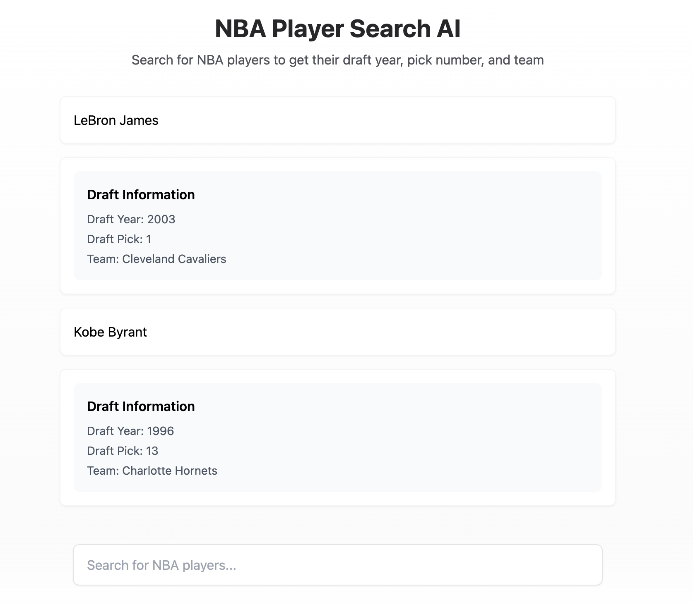

# Gen UI Demo

This forked demo is based on Tejas Kumar's talk on [React Server Components in AI Applications](https://www.youtube.com/watch?v=fsAYMNl1Cj0). I changed it to show NBA players' draft year, pick number, and team info using [DeepSeek Provider](https://sdk.vercel.ai/providers/ai-sdk-providers/deepseek) as the language model here.

It's helpful to check out https://github.com/nicoalbanese/ai-sdk-fundamentals and https://github.com/vercel-labs/ai-sdk-preview-rsc-genui to learn more about AI SDK and generative UI.

## Running it locally

Follow these steps to run the demo locally:

1. Clone this repository and `cd` into it
2. Run `pnpm install`
3. Rename `.env.example` to `.env` and populate it with appropriate values
4. Run `pnpm dev` to start the development server
5. Open `http://localhost:3000` in your browser

## More to watch
Tejas Kumar – React Server Components in AI Applications, React Advanced 2024: https://www.youtube.com/watch?v=qlEsdo1F004
